This is the webpage for the (under review) CVIU paper: Scalable learning for bridging the species gap in image-based plant phenotyping

## [[ Paper ]](https://arxiv.org/abs/2003.10757) [[ BibTex ]](https://github.com/csiro-robotics/UPGen_Webpage/blob/master/docs/ward2020scalable.bib) [[ Dataset]](https://research.csiro.au/robotics/our-work/databases/synthetic-arabidopsis-dataset/) [[ Pretrained Model]](https://bitbucket.csiro.au/scm/ag3d/leaf_segmenter_public.git)

<div style="margin:0 auto"> 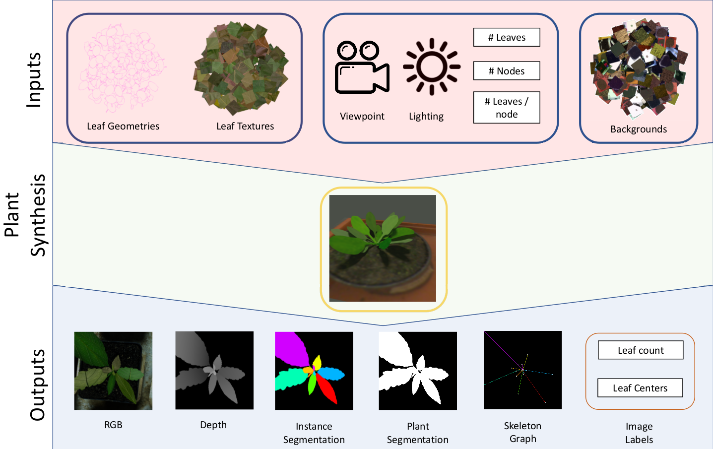 </div>

# Abstract
<div style="text-align: justify"> 
The traditional paradigm of applying deep learning -collect, annotate and train on data- is not applicable to image-based plant phenotyping. Data collection involves the growth of many physical samples, imaging them at multiple growth stages and finally manually annotating each image. This process is error-prone, expensive, time consumingand often requires specialised equipment. Almost 400,000 different plant species exist across the world. Each varying greatly in appearance, geometry and structure, a species gap exists between the domain of each plant species. The performance of a model is not generalisable and may not transfer to images of an unseen plant species. With the costs of data collection and number of plant species, it is not tractable to apply deep learning to the automation of plant phenotyping measurements. Hence, training using synthetic data is effective as the cost of data collection andannotation is free. We investigate the use of synthetic data for image-based plant phenotyping. Our conclusionsand released data are applicable to the measurement of phenotypic traits including plant area, leaf count, leaf areaand shape. In this paper, we validate our proposed approach on leaf instance segmentation for the measurement of leaf area. We study multiple synthetic data training regimes using Mask-RCNN when few or no annotated real data is available. We also present UPGen: a Universal Plant Generator for bridging thespecies gap. UPGenleverages domainrandomisation to produce widely distributed data samples and models stochastic biological variation. A model trained on our synthetic dataset traverses the domain and species gaps. In validating UPGen, the relationship between different data parameters and their effects on leaf segmentation performance is investigated. Imitating a plant phenotyping facility processing a new plant species, our methods outperform standard practices, such as transfer learning from publicly available plant data, by 26.6% and 51.46% on two unseen plant species respectively. We benchmark UPGen by using it to compete in the CVPPP Leaf Segmentation Challenge. Generalising across multiple plant species, our method achieved state-of-the-art performance scoring a mean of 88% across A1-4 test datasets.</div> 
Our synthetic dataset and pretrained model are available at [https://github.com/csiro-robotics/UPGen](https://github.com/csiro-robotics/UPGen).

# Synthetic Data Generation
We present, UPGen, a simulation based data pipeline which produces annotated synthetic images of plants. Our approach leverages Domain Randomisation (DR) concepts to model stochastic biological variation between plants of the same and different species. Training plant image analysis algorithms on our data learns a model which is robust to domain and species.

Our method has several benefits over other synthetic data approaches such as the use of GANs. These include:
* Fine control of data parameters - You have control over the dataset distribution.
* Fine control of the pipeline inputs - Easily swap in and out textures and leaf geometries to match your application domain to boost performance.

Example synthetic images and the corresponding leaf instance segmentation masks.
<div class="row" style="margin:0 auto">
    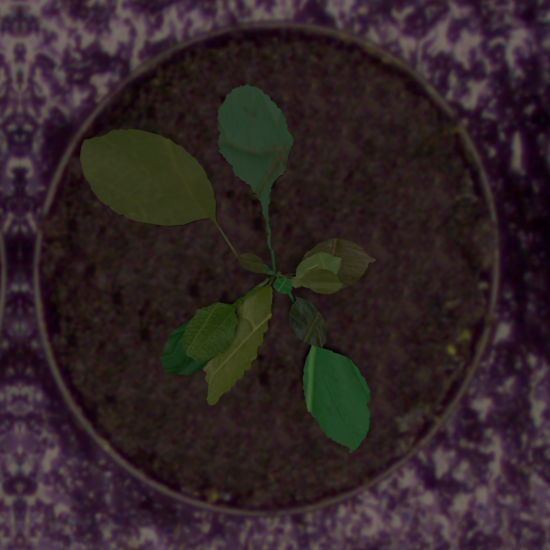
    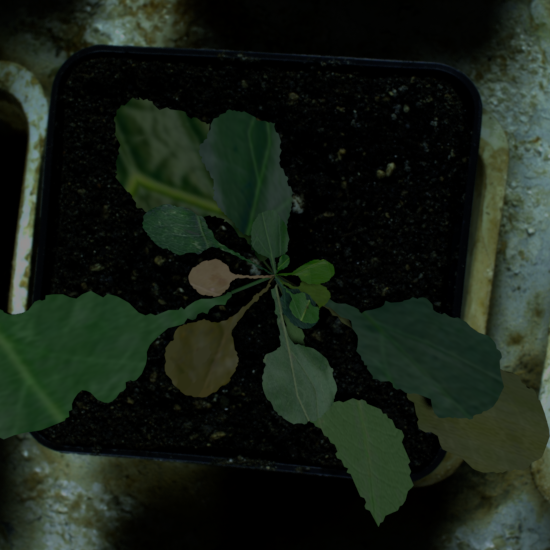
    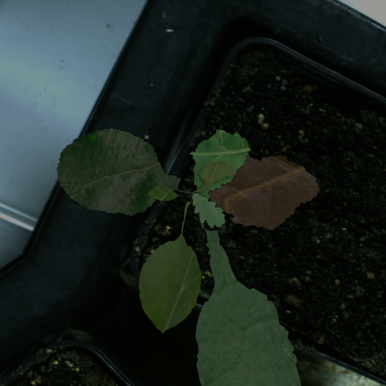
    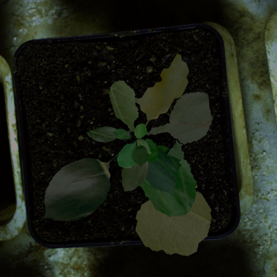
    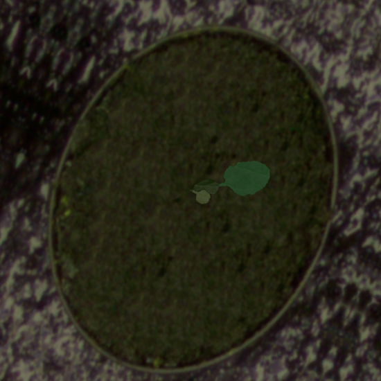
    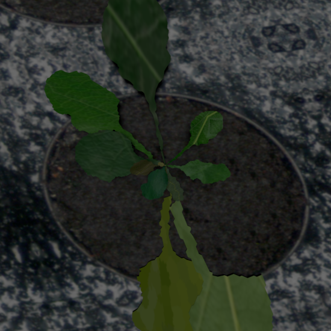
</div>
<div class="row" style="margin:0 auto">
    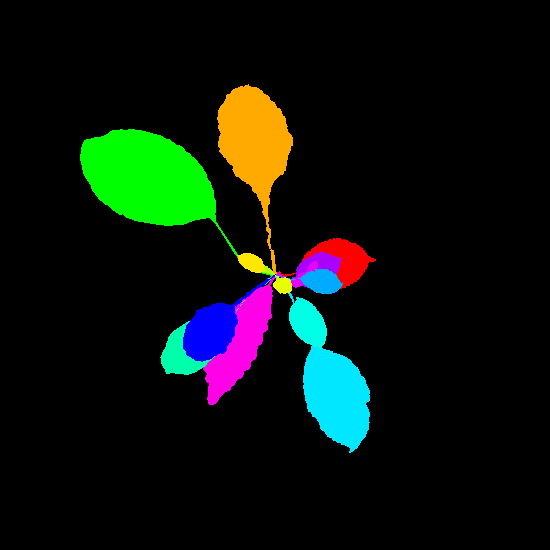
    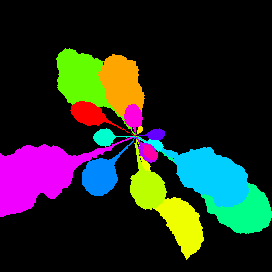
    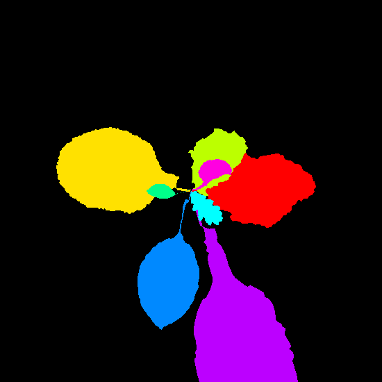
    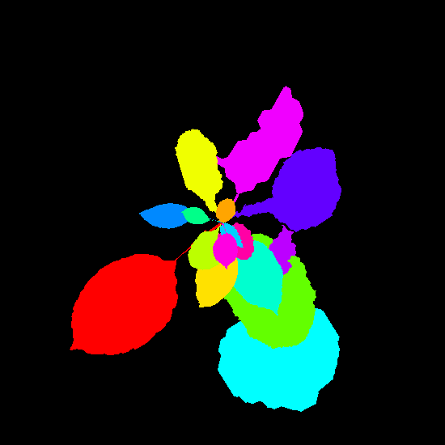
    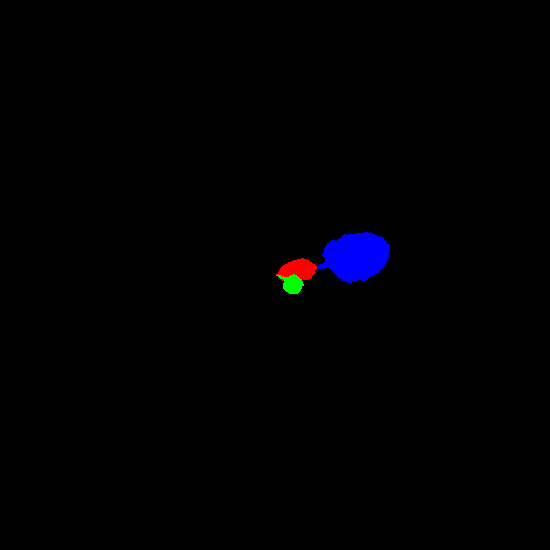
    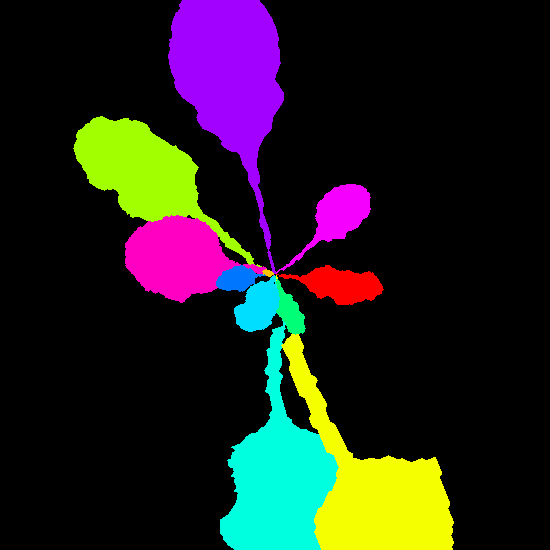
</div>


## Dataset
Our dataset will be available soon. Until then, our previous dataset is available for download [here](https://research.csiro.au/robotics/our-work/databases/synthetic-arabidopsis-dataset/)

# Results
We validate our approach on the task of leaf instance segmentation.

## In the wild
We train Mask-RCNN using our data and evauluate it on two completely unseen plant datasets, the [Komatsuna Dataset](http://limu.ait.kyushu-u.ac.jp/~agri/komatsuna/) and an in-house capsicum dataset. Using our data for training significantly outperformed the baseline of training on publicly available plant datasets.

Example segmentations on the Komatsuna dataset (left) and the capsicum dataset (right).
<div class="row" style="margin:0 auto">
    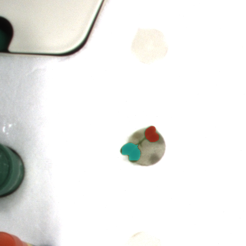
    
</div>

## The CVPPP Leaf Segmentation Challenge
We also compete in the [Computer Vision Problems in Plant Phenotyping (CVPPP) Leaf Segmentation Challenge (LSC)](https://www.plant-phenotyping.org/CVPPP2017-challenge). We achieve state of the art performance training Mask-RCNN using our synthetic data.

Example segmentations on test images. Left to right is an image from each test dataset: A1, A2, A3 and A4.
<div class="row" style="margin:0 auto">
    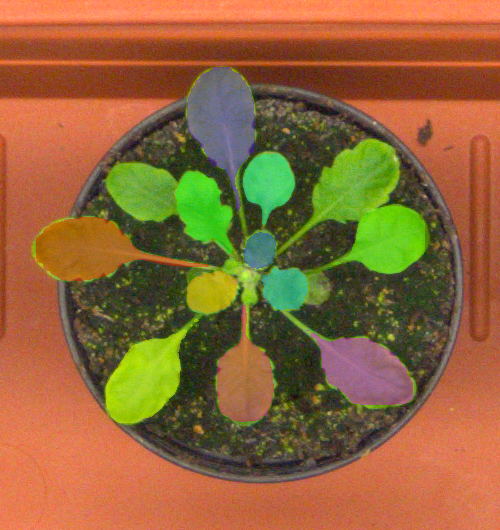
    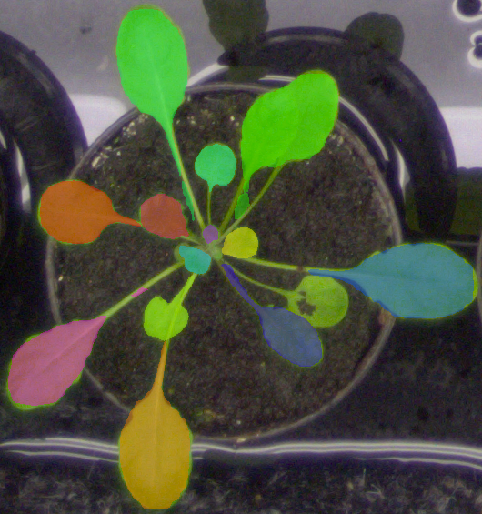
    
    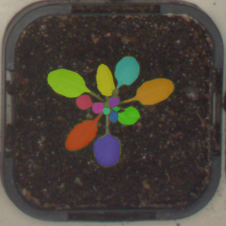
</div>

# Citation
```
@article{ward2020scalable,
  title={Scalable learning for bridging the species gap in image-based plant phenotyping},
  author={Ward, Daniel and Moghadam, Peyman},
  journal={arXiv preprint arXiv:2003.10757},
  year={2020}
}
```

# Previous Work
This paper builds on [Deep leaf segmentation using synthetic data](https://arxiv.org/abs/1807.10931).
```
@inproceedings{ward2018deep,
  title={Deep leaf segmentation using synthetic data},
  author={Ward, Daniel and Moghadam, Peyman and Hudson, Nicolas},
  booktitle={British Machine Vision Conference (BMVC) workshop on Computer Vision Problems in Plant Pheonotyping (CVPPP2018)},
  pages={26},
  year={2018}
}
```